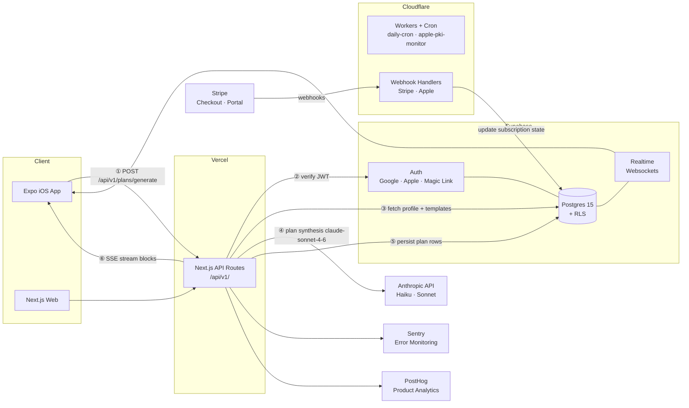

# Vesper

Vesper is a Life OS for young professionals. It ingests work, fitness, nutrition, sleep, calendar and location context and generates a complete, personalised daily plan — not a to-do list, but an ordered set of time blocks covering every domain of a day. Everything it says is written in a calm, formal butler voice, and every plan it produces is editable, explainable and reversible.

The product targets people who want adaptive planning across all of life rather than work scheduling alone. It ships on web and iOS, with a seven-day trial and a single paid tier.

## What it does

**AI daily plan engine.** The engine maintains a slow-moving base profile per user — work pattern, sleep targets, fitness goals, dietary constraints, recurring commitments — and generates each day as a diff against that base rather than from scratch. Tasks are movable units with durations, deadlines and priorities; the engine places them around calendar fixity and reflows them when a meeting lands on top of one. Conflicts it can resolve silently, it resolves silently; conflicts it cannot, it surfaces as a single question rather than dropping a commitment.

**A butler's notebook that shows its work.** Personalisation is surfaced, not silent. The engine periodically writes what it has inferred — "you move workouts to evenings; I'll plan them there" — with one-tap confirm or correct, so the user can see and steer the model being built of them.

**Five module surfaces.** Work and tasks, fitness, nutrition, medication and finance, each with its own page on web and iOS. Modules are independently toggleable and activate progressively rather than all at once. Fitness and nutrition draw on template libraries the engine selects from by goal, equipment, time available and energy; medication is the one module permitted to interrupt with a device notification, because the health stakes justify it.

**Calendar, two surfaces.** Google Calendar sync for people who already keep a schedule, and a built-in calendar for people who do not. Both feed the same data model and the same plan engine. Sync reads the user's primary calendar and is push-driven: a watch channel is registered per user, a webhook receives change notifications, and a scheduled worker renews channels before they expire.

**Web and iOS parity.** Both surfaces ship together. Mobile is an execution surface with full editing — drag-to-reorder, block detail, complete, skip, reschedule — and web is the configuration surface where profile setup, weekly planning and billing live. Both read the same Postgres through the same API.

**iOS Live Activities and Dynamic Island.** One Live Activity per block lifecycle, so the next block stays glanceable without opening the app. The Swift widget and alarm-extension sources and the shared payload contract are in this repository; the Xcode target wiring is a macOS step and is tracked as open work.

**Weekly planning.** A five-step Sunday session across both platforms — prior-week review, priority entry, an upcoming-events pass, module adjustments, and a review grid with a batched accept.

**Subscription billing on two rails.** Stripe Checkout and Customer Portal on web, StoreKit 2 in-app purchase on iOS, reconciled into one canonical subscription state machine so a user's entitlement does not depend on where they paid.

## In development

Vesper is an active solo project. The following are specified and partially built; in each case the parts named as present are in this repository and the parts named as absent are not.

- **Cron-driven prompt-cache prewarm.** The layered prompt and its `cache_control` markers exist in `@vesper/ai`; the worker module that warms the cache ahead of a user's morning does not.
- **Transactional email dispatch.** Five templates are authored under `packages/shared/emails/` and the `email_queue` table ships in the migrations; there is no producer and no consumer.
- **Onboarding UI surfaces.** The resume-state machine at `packages/shared/src/onboarding/state.ts` derives the correct step from which fields a user has populated; the screens it drives are not built.
- **A client surface for the natural-language command endpoint.** `POST /api/v1/ai/command` ships with its parser and its integration tests; no web or mobile surface calls it yet.
- **Server-side APNs push for Live Activities.** The Swift sources and the shared payload contract are present; the sender that starts and ends an activity is not built.
- **Sleep and errands module surfaces.** Both are in the module schema and `recurring_errands` has a table; neither has an API route or a screen.
- **Deployment of the four Cloudflare workers.** All four are written and unit-tested; every `wrangler.toml` marks the account binding, the route and the secrets as Cutover steps.

## Stack

| Layer | Choice | What it actually does here |
|---|---|---|
| Web | Next.js 15, App Router, React 19, TypeScript strict | Renders every web surface and hosts all 51 `/api/v1/` routes. Mobile talks to the backend exclusively through these. |
| iOS | Expo SDK 54, React Native, NativeWind | iOS-only at V1. Swift sources for the Live Activity widget and the notification-content alarm extension live alongside the RN app. |
| Database | Supabase Postgres 15, Drizzle ORM | 28 tables, 23 of them modelled in the Drizzle schema. Row-level security is enabled on all 28: user tables carry own-row policies keyed to `auth.uid()`, the two shared template tables are read-all, the public waitlist accepts anonymous inserts, and four service-role tables carry no policy at all. |
| Migrations | Hand-written SQL | 28 forward migrations, each with a matching `.down.sql`. Never generated from TypeScript. |
| Auth | Supabase Auth | Google OAuth, Apple Sign In, email magic link. Password auth is disabled. |
| Background | Cloudflare Workers | Four workers: an hourly cron dispatcher, a weekly Apple root-CA expiry monitor, and two signature-verified webhook receivers for Stripe and Apple. All four are built and unit-tested; deployment is Cutover-gated. |
| AI | Anthropic API | `claude-sonnet-4-6` for plan synthesis and weekly review; `claude-haiku-4-5` for classification, template selection and natural-language parsing. The synthesis prompt is layered so its three stable layers carry `cache_control` and only the per-day layer is uncached. |
| Payments | Stripe, Apple StoreKit 2 | Checkout and Portal on web; StoreKit 2 with server-side JWS receipt verification against a pinned Apple root chain on iOS. |
| Observability | Sentry, PostHog | The Sentry SDK is wired across the client, server and edge runtimes, with a PII scrubber on `beforeSend`. A release workflow is present but inert without secrets, so no source maps are uploaded today. PostHog captures a small set of server-side auth and rate-limit events. |
| Monorepo | Turborepo, pnpm workspaces | Two apps, five packages (`shared`, `db`, `ai`, `apple`, `ui`), four workers. |
| Testing | Vitest | 130 test files. Database integration tests are gated behind an explicit env flag and a local Supabase stack. Playwright is configured for end-to-end tests but no specs are written yet. |

## Architecture

The numbered path is one morning plan generation. The client posts to `/api/v1/plans/generate` with its Supabase JWT; the API route validates that token against Supabase Auth before anything else runs, reads the user's profile, enabled modules, calendar events and applicable templates from Postgres, calls `claude-sonnet-4-6` with the assembled context, persists the resulting blocks, and streams them back over SSE so the client renders blocks as they arrive rather than after the whole plan completes. Stripe and Realtime are deliberately outside this hot path.

Package boundaries are enforced rather than conventional: `@vesper/db` and `@vesper/ai` are importable only from web API routes, and the mobile app can reach the backend only through `/api/v1/`. It never imports the database or AI packages at all.

## Engineering practices

These are the parts that separate this from a tutorial build.

- **Forward-only, immutable migrations.** Twenty-eight hand-written SQL migrations, each paired with a `.down.sql`. Applied migrations are never edited; corrections ship as new numbered migrations. A numbered allocation register prevents two parallel work streams claiming the same migration number. See [docs/MIGRATION_DISCIPLINE.md](docs/MIGRATION_DISCIPLINE.md).
- **Row-level security on every table.** Not a middleware check that can be forgotten — RLS is enabled at the database on all 28 tables, and every table holding user rows carries own-row policies keyed to `auth.uid()`, so a missing application-layer guard cannot leak another user's rows. The two shared template tables are read-all by design, the public waitlist accepts anonymous inserts, and the four internal tables carry no policy at all, which denies every client and leaves them reachable only by the service role. That key is server-only and never reaches a client bundle.
- **Fail-closed, signature-verified webhooks.** The Stripe worker verifies the signature against the raw request body before parsing anything and returns 400 on mismatch. The Apple worker verifies the StoreKit 2 JWS by walking its `x5c` certificate chain to a **pinned** Apple root — the root travelling in the payload is never trusted — and rejects on any chain, validity-window or signature failure.
- **Encrypted OAuth token storage.** Google Calendar access and refresh tokens are encrypted application-side with libsodium XChaCha20-Poly1305 AEAD before they touch the database, so a database read alone does not yield usable tokens. Key rotation is a documented procedure.
- **A CI gate that actually gates.** Every pull request to `main` must build cleanly, lint clean and pass the full Vitest suite before it can merge, enforced as a required status check. No credentials are exposed to that workflow at all. A Playwright job is wired into the same workflow ahead of the end-to-end specs being written, and currently runs no tests.
- **An eval harness for prompt work.** Ten fixture scenarios spanning archetypes, calendar densities and energy states, scored against a written rubric with an explicit pass bar, so changes to plan-synthesis prompts are measured instead of eyeballed. See [packages/ai/eval/SCORING_RUBRIC.md](packages/ai/eval/SCORING_RUBRIC.md).
- **A real Content Security Policy.** The production `script-src` carries no `unsafe-eval` and no `unsafe-inline`.
- **Documented, locked architecture decisions.** Twenty-two decisions recorded with their reasoning and their rejected alternatives, so later work extends the decisions rather than relitigating them.

Further reading: [docs/ARCHITECTURE.md](docs/ARCHITECTURE.md) · [docs/ARCHITECTURE_DECISIONS.md](docs/ARCHITECTURE_DECISIONS.md) · [docs/TECHNICAL_SPEC.md](docs/TECHNICAL_SPEC.md) · [docs/ENV_VAR_DISCIPLINE.md](docs/ENV_VAR_DISCIPLINE.md) · [docs/DESIGN_SYSTEM.md](docs/DESIGN_SYSTEM.md)

## Licence

All rights reserved. No licence is granted to use, modify or redistribute this code. The source is published for review only.
