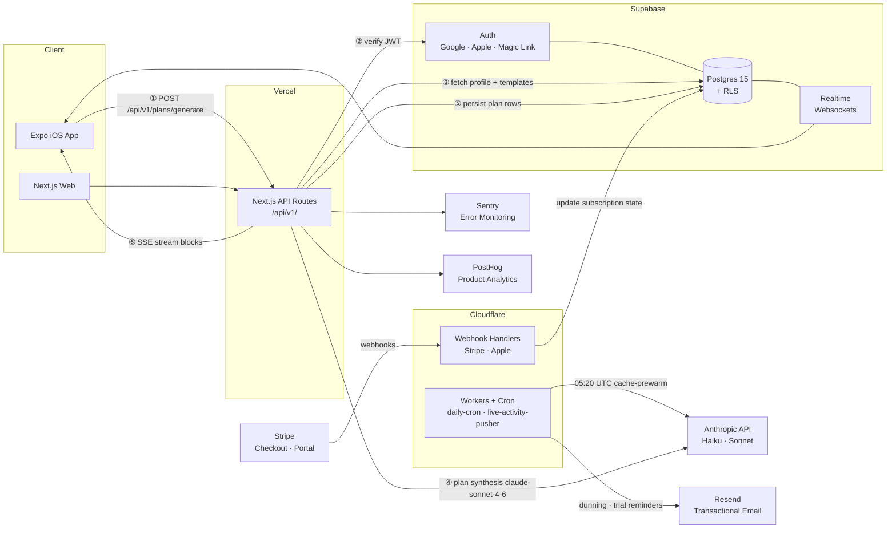

# Architecture

## System Diagram

## Morning Plan Generation — Request Trace

The numbered arrows above trace one complete request: a user opens the app in the morning and Vesper generates their daily plan.

| Step | What happens |
|---|---|
| Pre-condition | `cache-prewarm` Cloudflare Worker ran at 05:20 UTC, priming the Anthropic prompt cache for users whose local time is 05:20–05:30 |
| ① | Expo app sends `POST /api/v1/plans/generate` with the Supabase JWT in the `Authorization` header |
| ② | Next.js API route validates the JWT against Supabase Auth; rejects if expired or missing |
| ③ | API reads user profile, enabled modules, Google Calendar events for the day, and applicable plan templates from Postgres |
| ④ | API calls `claude-sonnet-4-6` via the Anthropic SDK with the assembled context; response streams via SSE |
| ⑤ | Completed plan blocks are persisted to Postgres (`daily_plans` + `plan_blocks` tables) |
| ⑥ | Streamed blocks are forwarded to the Expo client as SSE; the app renders blocks as they arrive |

Stripe, Resend, and Realtime are not in the plan-generation hot path. They activate on subscription events, email dispatch windows, and real-time plan edits respectively.

## Package Boundaries

| Package | Imports from | Imported by |
|---|---|---|
| `@vesper/shared` | zod, date-fns | all packages |
| `@vesper/db` | @vesper/shared, drizzle-orm, @supabase/supabase-js | @vesper/web (API routes only) |
| `@vesper/ai` | @vesper/shared, @ai-sdk/anthropic | @vesper/web (API routes only) |
| `@vesper/ui` | (none) | @vesper/web, @vesper/mobile |
| `@vesper/web` | all packages | (none — app) |
| `@vesper/mobile` | @vesper/shared, @vesper/ui | (none — app) |

Mobile communicates with the backend exclusively through `/api/v1/` routes. It never imports `@vesper/db` or `@vesper/ai`.
