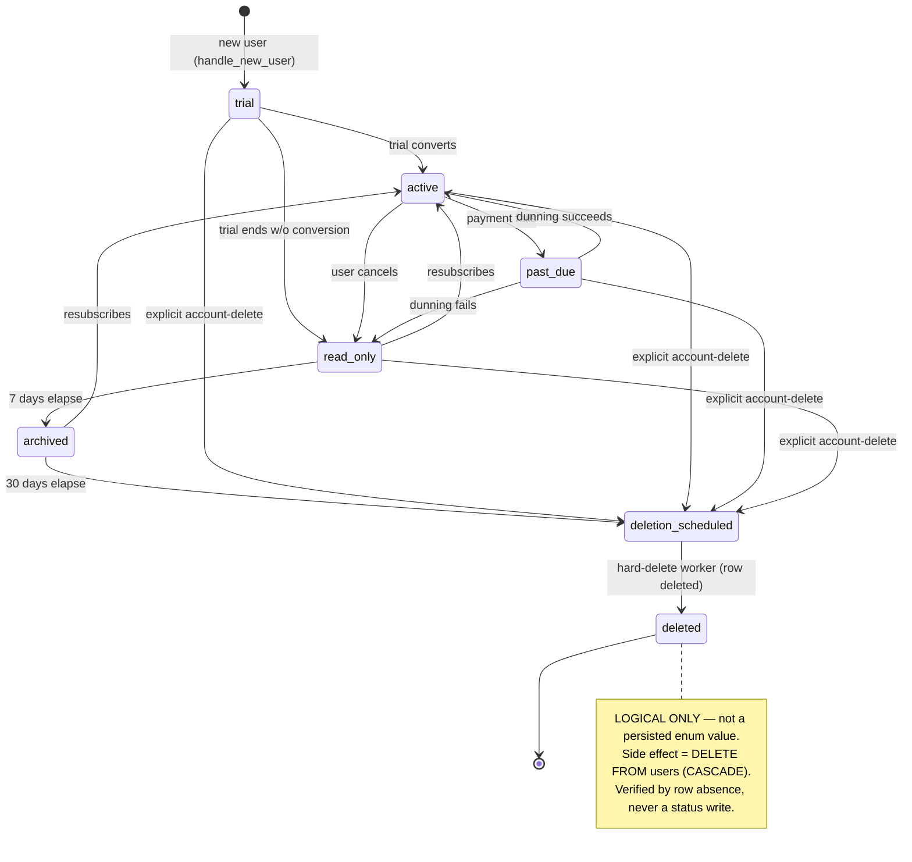

# Subscription State Machine

Canonical reference for `packages/shared/src/subscriptionState.ts` (Chat 081).
Authoritative source: `TECHNICAL_SPEC.md` §8 (Subscription & Billing, transition
table lines 1533–1539). This module is the ONE implementation of subscription
transitions; the Chat-030 throwing stubs at
`apps/web/lib/subscription/stateMachine.ts` are superseded and re-pointed in a
later chat.

## States

The persisted enum `subscription_status_enum` has **six** values:

```
trial · active · past_due · read_only · archived · deletion_scheduled
```

`deleted` is a **logical terminal only** — it is NOT in the enum. It models
row-ABSENCE: after the hard-delete worker removes the `users` row (CASCADE), the
subscription ceases to exist. No transition ever writes `status='deleted'`; the
`deletion_scheduled → deleted` edge's side effect is the row deletion itself,
**verified by absence**, never an enum write. `assertPersistable()` rejects any
non-enum status at runtime.



**Not a machine edge:** `deletion_scheduled → read_only` (account restore,
§8 line 1122 / §account-restore). `POST /api/v1/account/restore` performs its own
direct `users` UPDATE (clears `deletion_requested_at`, sets status back to
`read_only`) outside this state machine; the machine treats
`deletion_scheduled → read_only` as illegal.

## Concurrency & atomicity

Each transition:

1. opens a Postgres transaction;
2. `SELECT … FROM subscriptions WHERE user_id = $1 FOR UPDATE` — the row lock
   serializes concurrent Stripe/Apple webhooks firing for the same user within
   milliseconds;
3. validates the current `status` is a legal source for the target, else throws
   `IllegalSubscriptionTransitionError`;
4. applies side effects (below);
5. writes `subscriptions.status` AND the denormalized `users.subscription_status`
   cache atomically — both, always, in the same transaction;
6. rolls the whole transaction back on any mid-transition failure.

All access is **raw parameterized SQL** against the migration-008 columns. The
Drizzle `subscriptions` model is stale (missing `provider`, `status`, and five
other columns) and is deliberately not used.

## Functions (frozen signature: `fn(db, userId, …)`)

Downstream consumers — 072 (dunning), 082/084/086/087/088/089-W/090 — inherit
this signature.

### `transitionToActive(db, userId)`
Legal sources: `trial`, `past_due`, `read_only`, `archived`. Target: `active`.

Side effect — **referral_code mint**: after the status write, mint
`users.referral_code` if the user has none.

- Mint = 6-character base62 slug.
- **Idempotent**: a user who already has a code is left untouched; a later
  `transitionToActive` never changes an existing code.
- **Collision handling**: on a `UNIQUE` violation, regenerate and retry — up to
  `REFERRAL_MINT_MAX_ATTEMPTS` (5) attempts. The first collision does **not**
  throw.
- **SAVEPOINT per attempt**: each attempt runs inside its own nested transaction
  (a Postgres SAVEPOINT), not a bare try/catch. A `UNIQUE` violation aborts the
  surrounding transaction; without a savepoint the subsequent status UPDATE would
  fail with "current transaction is aborted". The savepoint rolls back only the
  colliding attempt, leaving the outer transition transaction intact.
- Live column type: `users.referral_code` is `text UNIQUE` (migration
  `20260601000002_users.sql`). No length constraint is encoded in code.

### `transitionToPastDue(db, userId)`
Legal source: `active`. Target: `past_due`. No external call.

### `transitionToReadOnly(db, userId, reason?)`
Legal sources: `trial` (non-conversion), `active` (cancel), `past_due` (dunning
fail). Target: `read_only`. No external call.

`reason?: CancellationReason` — **persisted** to `subscriptions.cancellation_reason`
when supplied (omitted for the trial-end and dunning-fail paths, which carry no
cancellation reason).

### `transitionToArchived(db, userId)`
Legal source: `read_only`. Target: `archived`. No external call.

### `transitionToDeletionScheduled(db, userId, reason?, opts?)`
Legal source: `archived` (the natural 30-days-elapsed cron path). Target:
`deletion_scheduled`. `reason?` persisted as above.

Provider-dependent side effect:

- **Stripe**: cancel the subscription via the injected `opts.stripe` client.
  **The cancel runs AFTER the transaction commits** — it is a non-transactional
  network call, and holding the `FOR UPDATE` row lock across it would
  serialize/deadlock concurrent webhooks (the exact race the lock prevents). The
  trade-off is a possible drift if Stripe fails after the DB commit
  (`status=deletion_scheduled` but the Stripe sub still active).
  **Reconciliation**: the later hard-delete / dunning sweep re-checks
  `deletion_scheduled` Stripe rows and re-issues the cancel; repeating the cancel
  is safe (cancelling an already-cancelled sub is a no-op/tolerated error).
- **Apple**: the server cannot cancel (Apple policy). Set
  `users.deletion_requested_at` (pure DB, inside the transaction) and rely on the
  UI instruction surface. No server cancel call.

### `requestDeletion(db, userId, reason?, opts?)`
The **explicit account-delete** edge (`* → deletion_scheduled`, §8 line 1538).
Legal sources: `trial`, `active`, `past_due`, `read_only`, `archived`. Target:
`deletion_scheduled`. Same provider side effects as
`transitionToDeletionScheduled`.

### `deletion_scheduled → deleted` (logical, no function)
Authored by the hard-delete worker in a later chat — **not** in this module. The
side effect is `DELETE FROM users` (CASCADE removes the subscription row). There
is no `transitionToDeleted` function and no code path writes `status='deleted'`;
the terminal is **verified by absence** of the row.

## Verification (no audit trigger)

There is **no** `subscriptions` audit trigger, and Chat 081 does not author one.
Verify a `trial → active` transition by:

1. `subscriptions.status` updated to `active`;
2. `users.subscription_status` cache updated to `active`;
3. `users.referral_code` minted (non-null, 6 chars).

Do **not** verify via `security_audit_log` — no trigger writes it for these
transitions. See `PHASE_4` finding #1: the owning migration chat (006/008/011)
should add an `audit_subscriptions_changes()` AFTER UPDATE OF status trigger →
`security_audit_log`, because `subscription_events` (`UNIQUE(provider,event_id)`)
is webhook-only and misses non-webhook transitions (trial-end → read_only, the
referral mint, account-delete → deletion_scheduled).
